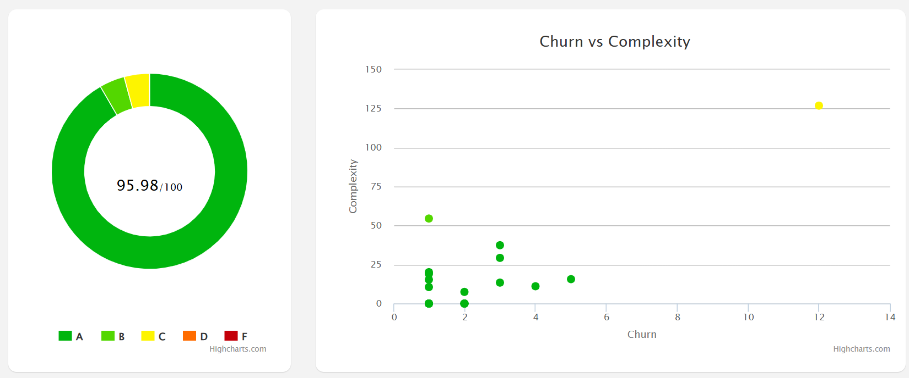
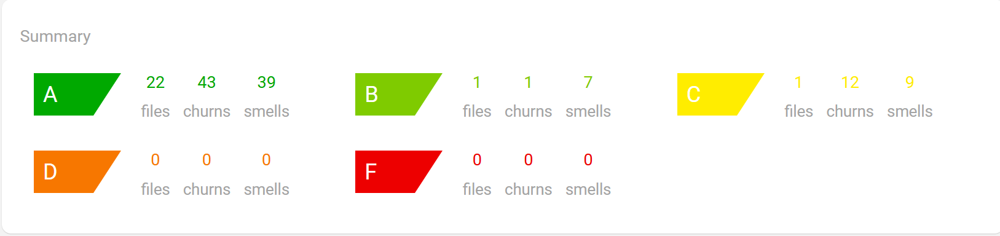
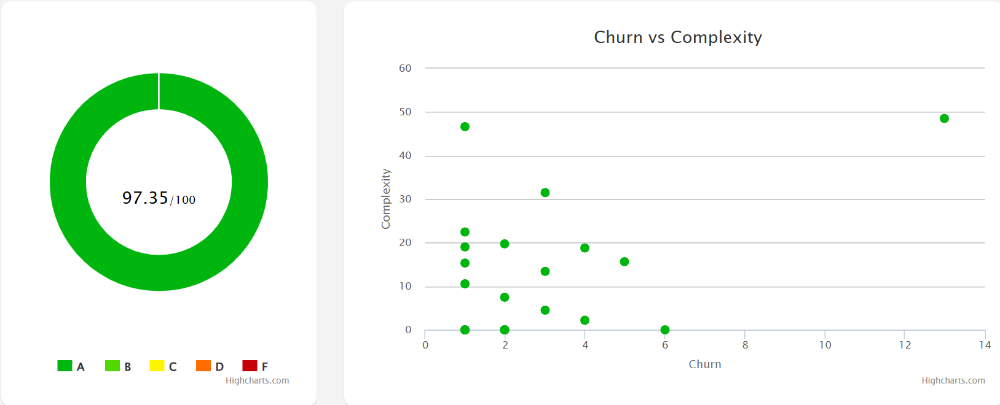
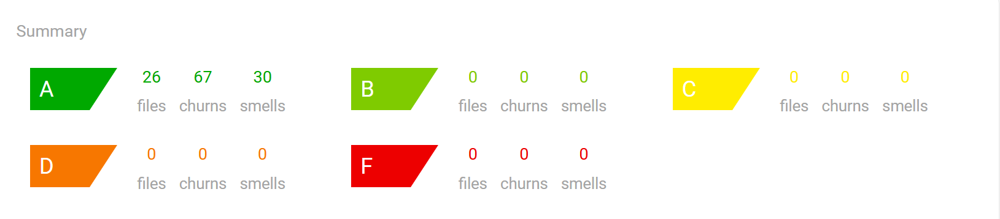

# Wiki da Sprint 3 - CAMAAR

## 1. Informações Gerais

### Resumo
Nesta terceira sprint, o foco do desenvolvimento mudou da implementação de funcionalidades para a **refatoração e documentação do código**, seguindo as diretrizes de qualidade de software do Capítulo 9 do livro *Engineering Software as a Service*. O objetivo foi melhorar a manutenibilidade, legibilidade e cobertura de testes do sistema CAMAAR.

### Integrantes

| Nome Completo | Matrícula |
|---------------|-----------|
| Caio Medeiros Balaniuk | 231025190 |
| Davi Henrique Vieira Lima | 231013529 |
| Lucca Schoen de Almeida | 231018900 |

## 2. Papéis da Equipe (Scrum)

**Product Owner (PO):** Davi Henrique Vieira Lima  
**Scrum Master (SM):** Lucca Schoen de Almeida

## 3. Metas Técnicas e Qualidade de Código

Diferente das sprints anteriores, esta etapa não focou em Histórias de Usuário novas, mas sim em critérios técnicos de aceitação para o código existente. As metas definidas foram:

### 3.1. Métricas de Complexidade
O código foi refatorado para atender aos seguintes limites de complexidade:
* **Complexidade Ciclomática (Saikuro):** < 10 por método.
* **ABC Score (RubyCritic):** < 20 por método.

### 3.2. Cobertura de Testes
A cobertura de testes foi ampliada utilizando RSpec e SimpleCov.
* **Meta:** > 90% de cobertura para todos os Controllers e Models implementados.

### 3.3. Testes de Aceitação (Cucumber/RSpec)
* **Requisito:** Implementação de cenários de *Happy Path* e *Sad Path* para todas as features.
* **Manutenção:** As features existentes foram mantidas para garantir que a refatoração não quebrasse funcionalidades.

### 3.4. Documentação (RDoc)
Todos os métodos foram documentados seguindo o padrão RDoc, contendo:
* Descrição do método.
* Argumentos recebidos.
* Valores de retorno.
* Efeitos colaterais.

## 4. Relatório de Refatoração

### 4.1. ABC Score
Antes das refatorações relativas ao ABC Score, os resultados gráficos do *Ruby Critic* são demonstrados a seguir:

Entre as principais informações, pode-se observar que o score geral do projeto estava em **95,98%** e dois arquivos estavam **fora da classe A**.

A partir disso, abaixo apresentamos as principais refatorações realizadas, com base no ABC Score (RubyCritic),  para adequar o código às métricas exigidas.

| Arquivo | Métrica (Antes) | Métrica (Depois) | Técnica de Refatoração Utilizada |
| :--- | :---: | :---: | :--- |
| `app/controllers/admins_controller.rb` |  126.84 |  48.52 | **Extract Class** (Criação do `TemplatesController`) e **Extract Service Object** (Criação do `FormDistributionService` para a lógica de envio). |
| `app/controllers/password_resets_controller.rb` |  54.49 |  31.5 | **Move Method** (Movimentação da lógica de validação e envio de e-mail para o model `Usuario`). |
| `app/models/usuario.rb` |  11.09 |  0.0 | **Extract Concern** (Extração da lógica de redefinição de senha para o módulo `PasswordResetable`, limpando o model principal). |
| `app/models/formulario.rb` |  37.39 |  2.2 | **Extract Service Object** (Criação do `FormularioExportService` para encapsular a lógica complexa de geração de CSV). |
| `app/controllers/sessions_controller.rb` |  20.12 |  19.74 | **Syntactic Sugar / Guard Clauses** (Uso do *Safe Navigation Operator* `&`. para simplificar condicionais de autenticação). |
| `app/controllers/formularios_controller.rb` |  29.27 |  18.79 | **Extract Service Object** (Criação do `FormResponseService` para processar e salvar respostas, retirando a lógica da action responder). |

Com essas refatorações, foram obtidos os seguintes resultados:

Entre as principais melhorias, destacam-se o aumento do **score** para **97.35%** e a passagem de todos arquivos para a **classe A**.

### 4.2. Complexidade Ciclomática

## 5. Relatório de Cobertura de Testes

Os testes foram executados utilizando RSpec e a cobertura medida via SimpleCov.

| Componente | Arquivo | Cobertura (%) |
|:---:|---|:---:|
| **...** | `...` | ...% |

**Cobertura Geral do Projeto:** ...%

## 6. Documentação

## 7. Conclusão