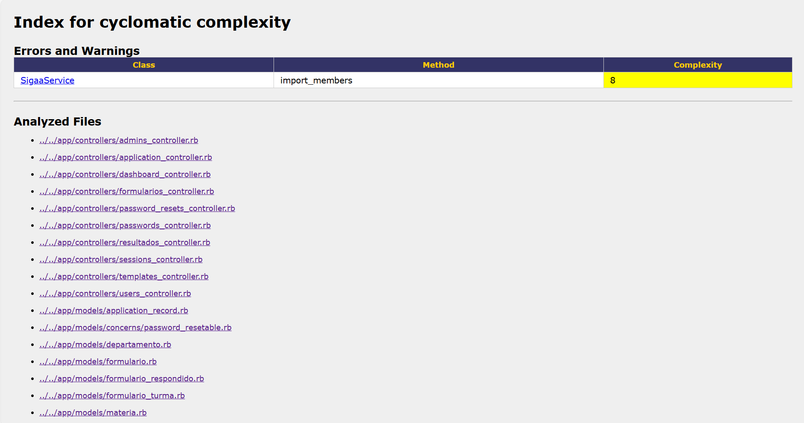

# Wiki da Sprint 3 - CAMAAR

## 1. Informações Gerais

### Resumo
Nesta terceira sprint, o foco do desenvolvimento mudou da implementação de funcionalidades para a **refatoração e documentação do código**, seguindo as diretrizes de qualidade de software do Capítulo 9 do livro *Engineering Software as a Service*. O objetivo foi melhorar a manutenibilidade, legibilidade e cobertura de testes do sistema CAMAAR.

### Integrantes

| Nome Completo | Matrícula |
|---------------|-----------|
| Caio Medeiros Balaniuk | 231025190 |
| Davi Henrique Vieira Lima | 231013529 |
| Lucca Schoen de Almeida | 231018900 |

## 2. Papéis da Equipe (Scrum)

**Product Owner (PO):** Davi Henrique Vieira Lima  
**Scrum Master (SM):** Lucca Schoen de Almeida

## 3. Metas Técnicas e Qualidade de Código

Diferente das sprints anteriores, esta etapa não focou em Histórias de Usuário novas, mas sim em critérios técnicos de aceitação para o código existente. As metas definidas foram:

### 3.1. Métricas de Complexidade
O código foi refatorado para atender aos seguintes limites de complexidade:
* **Complexidade Ciclomática (Saikuro):** < 10 por método.
* **ABC Score (RubyCritic):** < 20 por método.

### 3.2. Cobertura de Testes
A cobertura de testes foi ampliada utilizando RSpec e SimpleCov.
* **Meta:** > 90% de cobertura para todos os Controllers e Models implementados.

### 3.3. Testes de Aceitação (Cucumber/RSpec)
* **Requisito:** Implementação de cenários de *Happy Path* e *Sad Path* para todas as features.
* **Manutenção:** As features existentes foram mantidas para garantir que a refatoração não quebrasse funcionalidades.

### 3.4. Documentação (RDoc)
Todos os métodos foram documentados seguindo o padrão RDoc, contendo:
* Descrição do método.
* Argumentos recebidos.
* Valores de retorno.
* Efeitos colaterais.

## 4. Relatório de Refatoração

### 4.1. ABC Score
Antes das refatorações relativas ao ABC Score, os resultados gráficos do *Ruby Critic* são demonstrados a seguir:


Entre as principais informações, pode-se observar que o score geral do projeto estava em **95,98%** e dois arquivos estavam **fora da classe A**.


A partir disso, abaixo apresentamos as principais refatorações realizadas, com base no ABC Score (RubyCritic),  para adequar o código às métricas exigidas.

| Arquivo | Métrica (Antes) | Métrica (Depois) | Técnica de Refatoração Utilizada |
| :--- | :---: | :---: | :--- |
| `app/controllers/admins_controller.rb` |  126.84 |  48.52 | **Extract Class** (Criação do `TemplatesController`) e **Extract Service Object** (Criação do `FormDistributionService` para a lógica de envio). |
| `app/controllers/password_resets_controller.rb` |  54.49 |  31.5 | **Move Method** (Movimentação da lógica de validação e envio de e-mail para o model `Usuario`). |
| `app/models/usuario.rb` |  11.09 |  0.0 | **Extract Concern** (Extração da lógica de redefinição de senha para o módulo `PasswordResetable`, limpando o model principal). |
| `app/models/formulario.rb` |  37.39 |  2.2 | **Extract Service Object** (Criação do `FormularioExportService` para encapsular a lógica complexa de geração de CSV). |
| `app/controllers/sessions_controller.rb` |  20.12 |  19.74 | **Syntactic Sugar / Guard Clauses** (Uso do *Safe Navigation Operator* `&`. para simplificar condicionais de autenticação). |
| `app/controllers/formularios_controller.rb` |  29.27 |  18.79 | **Extract Service Object** (Criação do `FormResponseService` para processar e salvar respostas, retirando a lógica da action responder). |

Com essas refatorações, foram obtidos os seguintes resultados:


Entre as principais melhorias, destacam-se o aumento do **score** para **97.35%** e a passagem de todos arquivos para a **classe A**.

### 4.2. Complexidade Ciclomática
Para a avaliação da complexidade ciclomática dos métodos do projeto, foi utilizada a ferramenta **Saikuro**, conforme recomendado na especificação da atividade. O Saikuro é uma ferramenta de análise estática para código Ruby que calcula a complexidade ciclomática de cada método a partir da contagem de pontos de decisão no fluxo de controle.

Devido a limitações de compatibilidade da ferramenta com versões mais recentes da linguagem Ruby, foi necessário **reduzir temporariamente a versão do Ruby para 2.6.10**, versão que apresenta maior estabilidade e compatibilidade com o Saikuro. Essa alteração foi realizada apenas em nível local, sem impactar a configuração original do projeto ou o ambiente de desenvolvimento principal.

A análise foi aplicada exclusivamente aos arquivos responsáveis pela lógica da aplicação, concentrados nos diretórios:

- `app/controllers`
- `app/models`
- `app/services`
- `app/helpers`

Os relatórios gerados pela ferramenta foram organizados no diretório:

```
tmp/saikuro_report
```

Nesse diretório encontram-se tanto os relatórios agregados quanto os arquivos HTML individuais gerados para cada arquivo Ruby analisado, permitindo uma inspeção detalhada da complexidade de cada método.

Após a execução da análise, **não foram identificados métodos com complexidade ciclomática maior ou igual a 10**, indicando que todos os métodos avaliados estão em conformidade com o critério estabelecido para o projeto. Dessa forma, não foi necessária a refatoração de métodos com base nesse indicador.

A imagem a seguir demonstra isso:


## 5. Relatório de Cobertura de Testes

Os testes foram executados utilizando RSpec e a cobertura medida via SimpleCov.

| Componente | Arquivo | Cobertura (%) |
|:---:|---|:---:|
| **...** | `...` | ...% |


**Cobertura Geral do Projeto:** ...%

## 6. Documentação
Para garantir a manutenibilidade e a clareza do código desenvolvido, utilizamos a ferramenta **RDoc** para gerar a documentação técnica do projeto. O foco foi documentar as classes e métodos de lógica de negócio implementados pelo grupo, incluindo *Controllers*, *Models*, *Services* e *ViewComponents*.

### 6.1. Padrão Adotado
Seguindo as diretrizes da entrega, todos os métodos criados foram documentados respeitando a seguinte estrutura de comentários:

* **Descrição**: Explicação concisa sobre a responsabilidade do método.
* **Argumentos (Args)**: Listagem dos parâmetros recebidos e seus tipos.
* **Retorno**: O que o método devolve (objeto, booleano, redirecionamento, etc.).
* **Efeitos Colaterais**: Alterações de estado, banco de dados, envio de emails ou redirecionamentos de rota.

O exemplo de documentação no código é dado a seguir:

```ruby
# Cria um novo template associado ao usuário atual.
#
# Args:
#   - template_params (Hash): Parâmetros recebidos do formulário contendo nome e questões.
#
# Returns:
#   - Redireciona para a lista de templates (index) em caso de sucesso.
#   - Renderiza a view 'new' novamente em caso de erro de validação.
#
# Side Effects:
#   - Cria um novo registro na tabela 'templates' do banco de dados.
#   - Define mensagens de flash (notice ou alert).
def create
  @template = current_user.templates.build(template_params)
  handle_persistence(@template, :new, "criado")
end
```

### 6.2. Cobertura da Documentação
Realizamos a varredura do código utilizando a flag `--coverage-report` do RDoc para garantir que nenhum método passasse despercebido.

O escopo da documentação abrangeu:

- **Models**: Regras de negócio, validações e Concerns (ex: PasswordResetable)
- **Controllers**: Actions de CRUD e métodos privados de controle
- **Services**: Lógicas complexas extraídas (ex: FormResponseService, SigaaService)
- **Components**: Lógica de exibição visual (Header, Sidebar, Button)

Dessa forma, foi atingido 100% de documentação nos arquivos do escopo do projeto (excluindo arquivos de configuração padrão do Rails e assets).

```ruby
Files: 54
Classes: 38 (0 undocumented)
Modules: 6 (0 undocumented)
Constants: 0 (0 undocumented)
Attributes: 0 (0 undocumented)
Methods: 61 (0 undocumented)

Total: 105 (0 undocumented)
100.00% documented
```

### 6.3. Geração da Documentação
Para gerar ou visualizar a documentação localmente, execute os seguintes comandos na raiz do projeto:

- **Gerar os arquivos HTML**
```bash
bundle exec rdoc --output doc --main README.md
```

- **Verificar a cobertura**
```bash
bundle exec rdoc --coverage-report app
```

- **Visualizar**

Abra o arquivo `doc/index.html` em seu navegador para navegar pela documentação interativa.